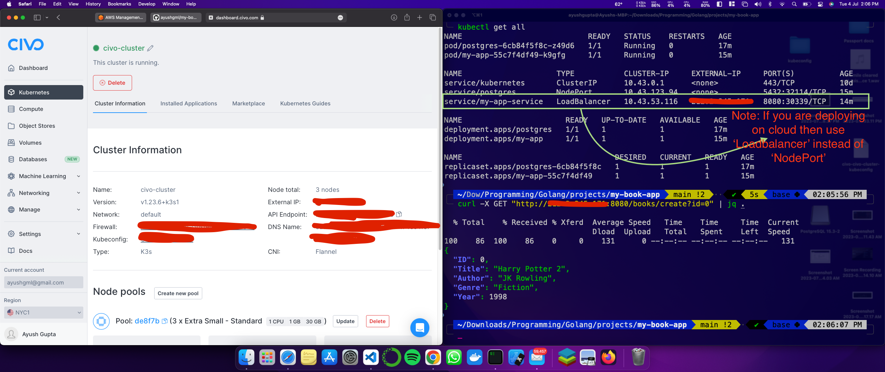
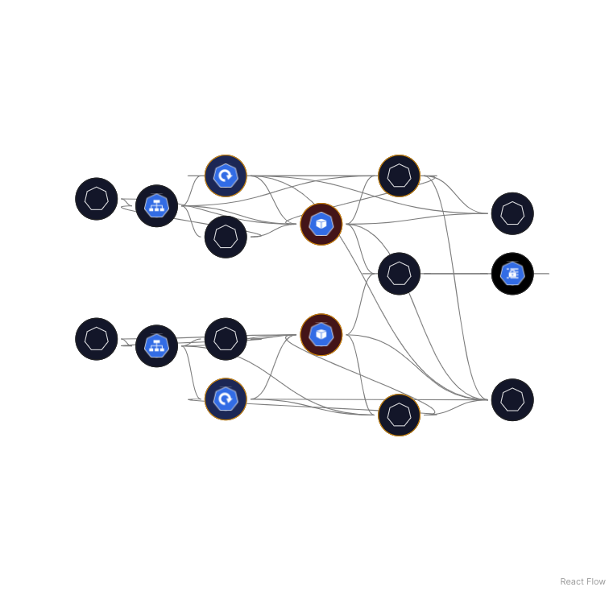

<a name="readme-top"></a>

<!-- PROJECT LOGO -->
<br />
<div align="center">
  <a href="https://github.com/ayushgml/mongo-on-k8s">
  
  </a>

  <h1 align="center">My Book App</h1>

  <p align="center">
    Go-PostgreSQL app containerization and deployment on Kubernetes
</div>

<!-- ABOUT THE PROJECT -->

## About The Project

This project is a Go backend API with PostgreSQL as the database. The app is containerized using Docker and deployed on Kubernetes. The app is deployed on a single node cluster using Minikube. The app is exposed to the host machine using NodePort service type. Following tech stack is used in the project:

- Go
- PostgreSQL
- Docker
- Kubernetes

Prequisites:

- Docker installed on the host machine
- Minikube installed on the host machine
- Some knowledge about YAML (you can learn that from <a href="https://itsayush.hashnode.dev/yaml-and-monokle">here</a>)
- Some knowledge about Kubernetes (you can learn that from <a href="https://itsayush.hashnode.dev/k8s-101">here</a>)
- A cloud Provider account such as AWS, Civo, Azure, Google cloud etc. (I am using Civo in this project). This is onnly if you want to deploy your cluster on cloud.

## Project Structure

```
.
├── Dockerfile
├── README.md
├── api
│   └── book_handler.go
├── cmd
│   └── main.go
├── deployment.yaml
├── go.mod
├── go.sum
├── ingress.yaml
├── internal
│   ├── book
│   │   └── book.go
│   └── student
│       └── student.go
├── postgres-config.yaml
├── postgres-deployment.yaml
├── postgres-service.yaml
├── postgres-storage.yaml
├── service.yaml
└── storage
    └── book_repository.go
```

<!-- GETTING STARTED -->

## Architecture


The API request goes to ingress controller which then forwards the request to my-app service. The service then forwards the request to the my-app pod. The image for the pod is being pulled from Dockerhub. The pod then connects to the PostgreSQL database which is also running in a pod. The database is also running in a pod and the image is being pulled from Dockerhub. The database pod is connected to a persistent volume which is used to store the data. The persistent volume is connected to a persistent volume claim which is used to claim the storage from the persistent volume. The persistent volume claim is connected to the database pod. The database pod is connected to a service which is used to expose the database pod to the my-app pod.

## Installation

1. Clone the repo

   ```sh
   git clone https://github.com/ayushgml/my-book-app.git
   cd my-book-app
   ```

2. Make sure minkube and docker and installed and running on the host machine

   ```sh
   minikube start
   ```

3. Now run the following commands

   ```
    kubectl apply -f postgres-config.yaml
    kubectl apply -f postgres-storage.yaml
    kubectl apply -f postgres-deployment.yaml
    kubectl apply -f postgres-service.yaml
    kubectl apply -f deployment.yaml
    kubectl apply -f service.yaml
    kubectl apply -f ingress.yaml
   ```

   The sate of the cluster should look like this:

    

4. Now if you encounter any errors then you can run the following command to check the logs of the pod

   ```
   kubectl logs <pod-name>
   ```

   Or you can describe the pod to check the status of the pod

   ```
   kubectl describe pod <pod-name>
   ```

#### Running on cloud

5. Now I deployed it on Civo cloud(because I found it cheaper to deploy on that). So I had to create a firewall rule to allow traffic on port 8080(it may be on by default). You can do the same on your cloud provider. If you are using Minikube then you can stop here.
   I downloaded the kubeconfig file from Civo(you can download from your cloud provider cluster) and then ran the following command to connect to the cluster.

   ```
   kubectl config use-context civo-cluster
   ```

6. Now you need to make a change from NodePort to LoadBalancer in the service.yaml file. Then run the following command
   Before:
   ```
   spec:
   selector:
   app: my-app
   ports:
   - protocol: TCP
     port: 8080
     targetPort: 8080
   type: NodePort         # <--- For minkube
   ```

    After:

    ```

    spec:
    selector:
    app: my-app
    ports: - protocol: TCP
    port: 8080
    targetPort: 8080
    type: LoadBalancer     # <--- For cloud providers

    ```
    Then run the following command
    ```

    kubectl apply -f service.yaml
    ```

    Reason for using NodePort in minkube is that there is no LoadBalancer integrated (unlike AWS or Google Cloud). With this default setup, you can only use NodePort or an Ingress Controller. When using cloud providers, you can use LoadBalancer.

7. Now run ```kubectl get all``` to get the IP address of the LoadBalancer. Now you can send requests to the IP address of the LoadBalancer. Send the request to the external-ip address of the LoadBalancer on port 8080. You can use Postman/Thunderclient/cURL to send the requests.

    


## Cluster graph
The below graph is made with Monokle graph view of default namespace with depth=5 from Persistent Volume Claim.


<!-- CONTACT -->

## Contact

Ayush Gupta - [@itsayush\_\_](https://twitter.com/itsayush__) - ayushgml@gmail.com

[Project link](https://github.com/ayushgml/my-book-app)

